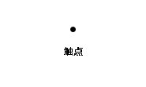
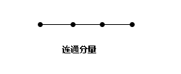
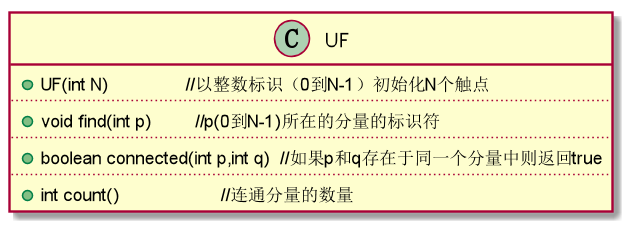

#unino-find算法

##应用场景：  
输入一些整数，这些整数可以表示的是电子电路中的触点，而整数对 表示的是连接触点之间的电路；或者这些整数可能是社交网络中的人
，而整数对表示的是朋友关系。总的来说，我将其理解为查找对象之间关系的一种算法.
##知识储备
####等价类

我们假设对象（p与q）之间存在关系是一种相连的话，这就意味着这种“关系”存在一种等价性(例如1 < 2,2 < 3,则1 < 3),这就意味着它具有：   
自反性：p 和 p是相连的;  
对称性：如果p和q是相连的，那么q和p也是相连的;  
传递性：如果p和q是相连的且q和r是相连的，那么p和r也是相连的。  
等价关系能够将对象分为多个等价类，当且仅当两个对象相连的时候他们才输入同一个等价类。  
####术语
将对象称为*触点*,将对象间的堆成称为*连接*，将等价类称为*连通分量*或简称为分量  

  

##算法实现

####API
union-find算法的API  
  
如果连个触点在不同的分量中，union()操作将会将两个分量归并。find()操作会返回给定触点所在连通分量的标识符。connencted()判断两个触点是
否在于同一个分量之中。count()方法会返回所有连通分量的数量。一开始我们有N个分量，将两个分量归并的每次union()操作都会使分量总数减一。

